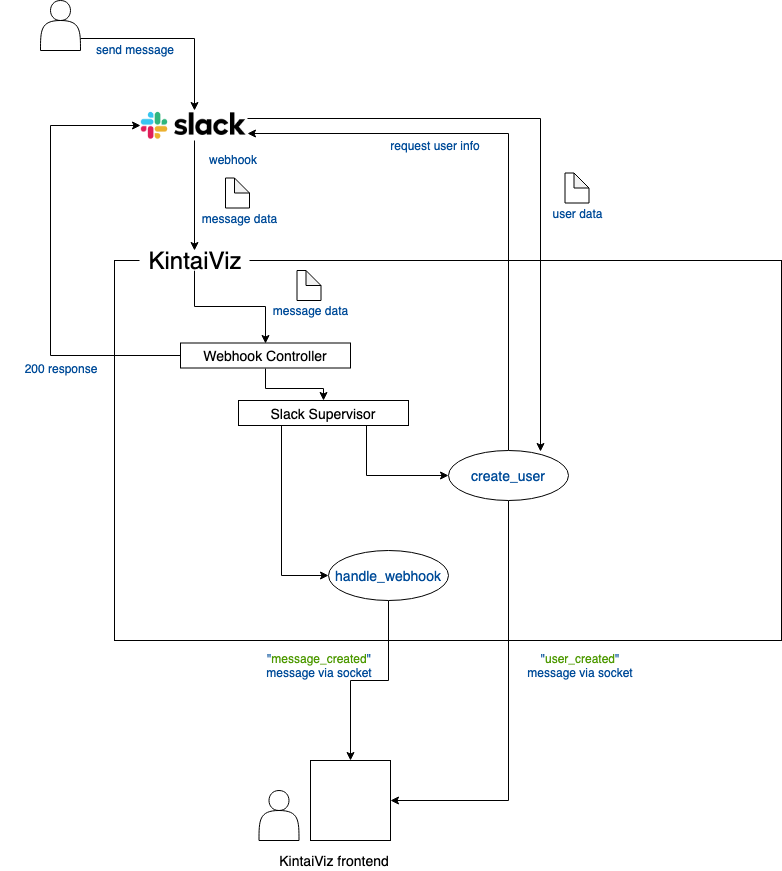

# KintaiViz

The sample application to demonstrate the code in Elixir and Phoenix.
KintaiViz listen to the webhook from our slack's Kintai channel and visualize
them in real time.

## Prerequisite
- Elixir (>=1.7)
- PostgreSQL
- Node

## Installation
1. Rename `.env.example` to `.env` then edit that file by adding your db username
and password. You can leave the database name as is.
2. Run `source .env` to load the system variable.
3. Run `mix deps.get`
4. Run `mix ecto.create`
5. Run `mix ecto.migrate`

## Up & Running
1. When you access the folder for the first time, run `source .env` to load the
environment variables.
2. Run `iex -S mix phx.server`. This will start the server at `localhost:4000`

## How it works

Slack sends the webhook whenever there is a new message. The webhook will arrive at `/slack/webhook` endpoint and will be taken care
by `Webhook Controller`. The controller notices the `Slack Supervisor` to handle a message and create a user. The supervisor splits
these two actions separately on different processes (as background tasks), then `Webhook Controller` response `200` to slack (to reply
the webhook). `handle_webhook` will create the message on the database based on the data sent from Slack. Once it is finished, it will
send the socket message `message_created` to the frontend through web socket connection. In the meantime, `create_user` sends the request
to Slack API to acquire user info. Once the user info is acquired, it persists the data and send the socket message `user_created` to
the frontend as well.
